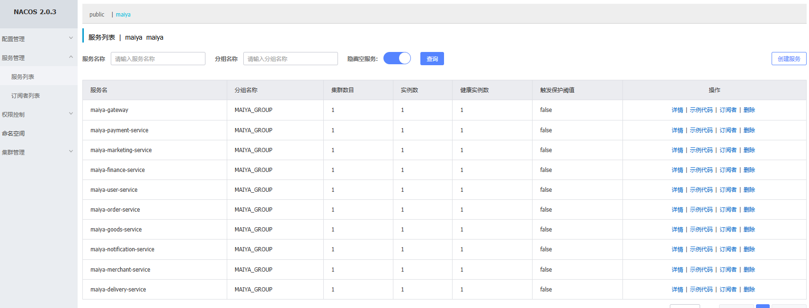

# 麦芽优选（MaiYa YouXuan）— 分布式微服务平台

> 本地生活 O2O 电商平台，连接消费者、商家、骑手三端。
> 基于 Spring Boot 3.4 + Spring Cloud 2024 的微服务架构。

---

## 目录

- [项目架构](#项目架构)
- [技术栈](#技术栈)
- [服务列表](#服务列表)
- [快速开始](#快速开始)
- [部署条件](#部署条件)
- [配置说明](#配置说明)
- [开发指南](#开发指南)
- [API 文档](#api-文档)
- [项目结构](#项目结构)

---

## 项目架构



```

                                  API Gateway (Spring Cloud Gateway)
                                        │
        ┌──────────┬──────────┬──────────┼──────────┬──────────┬──────────┐
        │          │          │          │          │          │          │
   User Service  Merchant   Goods     Order     Payment   Finance    Delivery
        │          │          │          │          │          │          │
   Notification  Marketing                                        (RocketMQ)
        │          │                                              事件驱动
   ─────┴──────────┴───────────────────────────────────────────────────────
        │
   Nacos (注册中心 + 配置中心)   │   SkyWalking (链路追踪)   │   ELK (日志)
```

### 核心流程

```
用户下单 → Gateway → Order Service → MQ → Payment Service → 支付宝/微信
                                                    │
                                              回调通知 → MQ → Order Service
                                                                    │
                                                          MQ → Finance/Delivery/Notification/Marketing
```

---

## 技术栈

### 基础框架

| 组件 | 版本 | 说明 |
|------|------|------|
| Java | 21 LTS | 虚拟线程、ZGC、模式匹配 |
| Spring Boot | 3.4.4 | 云原生应用框架 |
| Spring Cloud | 2024.0.1 (Moorgate) | 微服务治理 |
| Spring Cloud Alibaba | 2023.0.3.2 | 阿里云原生集成 |
| MyBatis-Plus | 3.5.9 | ORM 框架（统一替代 JPA + MyBatis）|

### 中间件

| 组件 | 版本 | 用途 |
|------|------|------|
| Nacos | 2.4.3 | 注册中心 + 配置中心 |
| Sentinel | 1.8.8 | 限流、熔断、降级 |
| RocketMQ | 5.3.2 | 异步消息、事件驱动 |
| Redis | 7.4.2 | 缓存、分布式锁、秒杀库存 |
| MySQL | 8.0.40 | 持久化存储 |
| SkyWalking | 10.2.0 | 全链路追踪 |
| Elasticsearch | 8.17.0 | 日志存储 + SkyWalking 存储 |
| Kibana | 8.17.0 | 日志检索 |
| Prometheus | 3.2.0 | 指标采集 |
| Grafana | 11.6.0 | 监控仪表盘 |

### 支付对接

| 渠道 | SDK | 模式 |
|------|-----|------|
| 支付宝 | `alipay-sdk-java 4.40.890.ALL` | RSA2 签名 |
| 微信 APP | HTTP XML 协议 | MD5 签名 |
| 微信小程序 | HTTP XML 协议 | MD5 签名 |

---

## 服务列表

| 服务 | 端口 | 说明 | 数据库 |
|------|------|------|--------|
| **maiya-gateway** | 8080 | API 网关（路由、鉴权、限流） | - |
| **maiya-user-service** | 8081 | 用户、认证、权限 | maiya_user |
| **maiya-merchant-service** | 8082 | 商家管理、营业时间 | maiya_merchant |
| **maiya-goods-service** | 8083 | 商品、类目、库存、购物车 | maiya_goods |
| **maiya-order-service** | 8084 | 订单、状态机、售后、CQRS | maiya_order |
| **maiya-payment-service** | 8085 | 支付宝/微信支付、退款 | maiya_payment |
| **maiya-finance-service** | 8086 | 钱包、账户流水、分润结算 | maiya_finance |
| **maiya-delivery-service** | 8087 | 配送单、骑手、配送站 | maiya_delivery |
| **maiya-marketing-service** | 8088 | 秒杀、拼团、抽奖、优惠券 | maiya_marketing |
| **maiya-notification-service** | 8089 | 推送、短信、易联云打印 | maiya_notification |

### 服务依赖关系

```
User Service ← 无外部依赖
Merchant Service → User Service
Goods Service → Merchant Service
Order Service → User, Merchant, Goods, Payment, Finance, Delivery, Marketing
Payment Service → Order Service
Finance Service → Order Service
Delivery Service → Order Service, Merchant Service
Marketing Service → Order Service
Notification Service → Order Service
```

---

## 快速开始

### 环境要求

- JDK 21+
- Maven 3.9+
- MySQL 8.0+
- Redis 7.0+
- RocketMQ 5.x（可选，事件驱动需要）
- Nacos 2.x（可选，服务发现需要）

### 本地开发

```bash
# 1. 启动依赖服务（MySQL, Redis, Nacos）
docker-compose -f docker/dev.yml up -d

# 2. 创建数据库（按需）
mysql -h localhost -u root -p < ../database/init.sql

# 3. 编译 common 库
cd maiya-common
mvn clean install

# 4. 启动网关
cd ../maiya-gateway
mvn spring-boot:run -Dspring-boot.run.profiles=dev

# 5. 逐个启动微服务（推荐按依赖顺序）
cd ../maiya-user-service
mvn spring-boot:run -Dspring-boot.run.profiles=dev
```

### 生产部署

```bash
# 1. 编译所有服务
mvn clean package -DskipTests

# 2. 构建 Docker 镜像
docker build -t registry/maiya-user-service:latest -f docker/Dockerfile .

# 3. 部署到 Kubernetes
kubectl apply -f k8s/
```

---

## 部署条件

### 服务器要求（最低配置）

| 节点 | CPU | 内存 | 磁盘 | 部署组件 |
|------|-----|------|------|----------|
| hadoop001 | 4核 | 12 GB | 200 GB | Nacos/Nginx/Redis/微服务 x3 |
| hadoop002 | 4核 | 12 GB | 200 GB | Nacos/RocketMQ/微服务 x3 |
| hadoop003 | 4核 | 8 GB | 200 GB | Nacos/MySQL/微服务 x2 |
| hadoop004 | 2核 | 4 GB | 40 GB | 轻量微服务 x2 |

### 依赖中间件

| 中间件 | 节点数 | 版本 | 说明 |
|--------|--------|------|------|
| Nacos | 3 | 2.4.3 | 注册中心集群 |
| RocketMQ | 4 (2m-2s) | 5.3.2 | 消息队列 |
| Redis | 2 (主从) | 7.4.2 | 缓存/分布式锁 |
| MySQL | 2 (主从) | 8.0.40 | 持久化 |
| Elasticsearch | 3 | 8.17.0 | 日志/追踪存储 |

### 环境变量

```bash
# 必须配置（无默认值，服务启动失败时会报错）
export WXPAY_MCH_KEY="微信商户密钥"
export WXXCX_APPSECRET="微信小程序密钥"
export ALIPAY_PRIVATE_KEY="支付宝RSA2私钥"
export JWT_SECRET="JWT签名密钥(至少32字符)"
export DB_PASSWORD="数据库密码"

# 可选配置（有默认值）
export ALIPAY_PUBLIC_KEY="支付宝公钥"
export YLY_CLIENT_SECRET="易联云API密钥"
```

### Nacos 配置

所有服务通过 Nacos 读取 `namespace: maiya, group: MAIYA_GROUP` 下的配置。生产环境建议：

1. 启用 Nacos 鉴权
2. 数据库密码通过 Nacos AES 加密存储
3. 每个环境（dev/test/prod）使用独立 Namespace

---

## 配置说明

### 密钥管理

所有敏感信息通过环境变量注入，详见 [密钥安全清单](../docs/密钥安全清单.md)。

### application.yml 分层

```
resources/
├── application.yml          # 公共配置（各服务独立）
└── application-dev.yml      # 开发环境覆盖（已加入 .gitignore）
```

### 关键配置项

```yaml
# 服务端口（默认）
server.port: 8081~8089

# 数据库（通过 DB_PASSWORD 环境变量）
spring.datasource.password: ${DB_PASSWORD}

# Nacos
spring.cloud.nacos.discovery.server-addr: hadoop001:8848,hadoop002:8848,hadoop003:8848

# RocketMQ
rocketmq.name-server: hadoop001:9876,hadoop002:9876
```

---

## 开发指南

### 新增一个微服务

```bash
# 1. 创建目录结构
mkdir -p maiya-xxx-service/src/main/java/ny/shop/youxuan/xxxservice/{config,controller,service/impl,entity,mapper}
mkdir -p maiya-xxx-service/src/main/resources

# 2. 复制 pom.xml 模板（参考其他服务）
# 3. 创建 Application.java + 实体 + Mapper + Service + Controller
# 4. 在 Gateway 中添加路由
# 5. 在 database/init.sql 中添加建表语句
```

### 代码规范

- 包名：`ny.shop.youxuan.{service}`
- 实体：MyBatis-Plus `@TableName` 注解
- Mapper：继承 `BaseMapper<T>` + `@Mapper` 注解
- Service：接口 + 实现分离
- Controller：External (`/api/xxx`) + Internal (`/internal/xxx`) 分离

### 事件驱动开发

```java
// 1. 定义事件（在 maiya-common 中）
public class OrderPaidEvent implements Serializable { ... }

// 2. 发送事件
rocketMQTemplate.convertAndSend(MqTopic.ORDER_PAID, event);

// 3. 消费事件
@Component
@RocketMQMessageListener(topic = MqTopic.ORDER_PAID, consumerGroup = "consumer-xxx")
public class XxxEventConsumer implements RocketMQListener<String> { ... }
```

---

## 项目结构

```
maiya-platform/
├── pom.xml                              # 父 BOM（版本管理）
├── README.md                            # 本文件
├── maiya-common/                        # 共享库
│   └── src/main/java/.../common/
│       ├── constant/                     # 常量、错误码、MQ主题
│       ├── dto/                          # 共享 DTO
│       ├── enums/                        # 跨服务枚举
│       ├── event/                        # MQ 事件消息体
│       ├── exception/                    # 业务异常
│       └── result/                       # ApiResult / PageResult
├── maiya-gateway/                       # API 网关
│   └── config/
│       ├── JwtAuthGlobalFilter.java     # JWT 鉴权
│       ├── RequestLoggingFilter.java    # 请求日志
│       └── SentinelConfig.java          # 限流熔断
├── maiya-user-service/                  # 用户服务
├── maiya-merchant-service/              # 商家服务
├── maiya-goods-service/                 # 商品服务
├── maiya-order-service/                 # 订单服务（含状态机 + CQRS）
├── maiya-payment-service/               # 支付服务（支付宝 + 微信）
├── maiya-finance-service/               # 财务服务（钱包 + 分润）
├── maiya-delivery-service/              # 配送服务
├── maiya-marketing-service/             # 营销服务（秒杀 + 抽奖 + 优惠券）
├── maiya-notification-service/          # 通知服务（推送 + 打印）
├── database/
│   └── init.sql                         # 全量建表脚本
└── docs/
    ├── 分布式事务补偿机制.md              # 分布式事务设计
    ├── 密钥安全清单.md                    # 密钥管理
    └── 秒杀系统高并发设计方案.md           # 秒杀设计
```

---

## License


