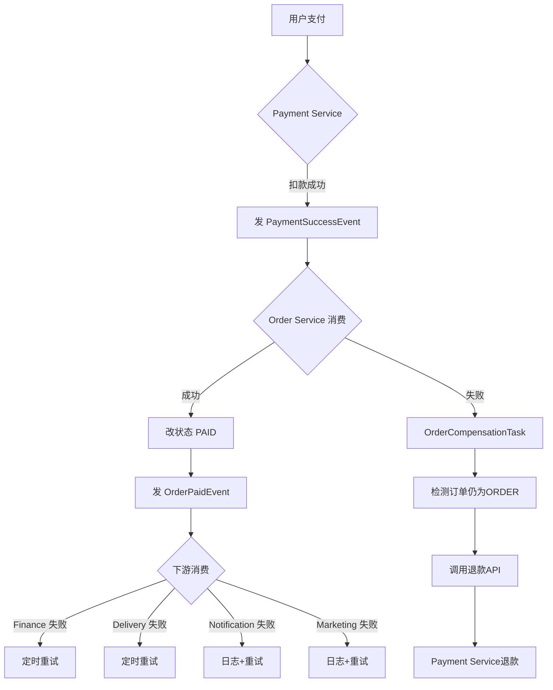

# 分布式事务补偿机制

## 一、设计原则

**最终一致性**：不追求强一致（强一致会引入 Seata AT 模式的性能瓶颈），采用"本地消息表 + MQ 重试 + 定时任务补偿"模式。

```
强一致性 (XA/2PC)       →  性能差，不适合高并发
最终一致性 (MQ+补偿)    →  本方案 ✅  允许秒级不一致
```

## 二、幂等性保障（第一道防线）

所有 MQ 消费者必须幂等，确保重复消息不产生重复业务。

```java
// 通用幂等模式：
// 1. 用 transaction_id / event_id 作为唯一键
// 2. 先查后插
PaymentRecord existing = paymentRecordMapper.findByTransactionId(txId);
if (existing != null) return; // 已处理，跳过
```

已实现位置：
- `PaymentServiceImpl.processPaymentCallback()` ✅

## 三、超时补偿（第二道防线）

| 补偿任务 | 服务 | 扫描间隔 | 处理逻辑 |
|----------|------|----------|----------|
| 支付超时关闭 | PaymentCompensationTask | 5分钟 | PENDING超30分钟 → 关闭 |
| 订单超时关闭 | OrderCompensationTask | 5分钟 | ORDER超30分钟 → USELESS |
| 结算重试 | FinanceCompensationTask | 10分钟 | 未结算订单 → 重新分润 |
| 配送重试 | DeliveryCompensationTask | 5分钟 | 待接单超30分钟 → 重新分配 |

## 四、Saga 补偿（第三道防线）

```
正向流程：
Payment(扣款) → Order(改状态) → Finance(记账) → Delivery(配送)

补偿流程（任意一步失败）：
Delivery ❌ → 仅记录日志，不影响主流程
Finance  ❌ → 定时重试
Order    ❌ → Payment 发起退款
Payment  ❌ → 用户重试
```

### 关键补偿场景：支付成功但订单处理失败

```
1. Payment Service 扣款成功
2. 发送 PaymentSuccessEvent
3. Order Service 消费失败（如数据库异常）
4. → OrderCompensationTask 检测到订单仍为 ORDER 状态
5. → 调用 Payment Service 的 refund() 退款
6. → Payment Service 调用支付宝/微信退款
```

## 五、实现清单

| 文件 | 状态 | 说明 |
|------|------|------|
| `PaymentCompensationTask.java` | ✅ | 支付超时 + 失败退款 |
| `OrderCompensationTask.java` | ✅ | 订单超时 + Saga回滚 |
| `FinanceCompensationTask.java` | ✅ | 结算重试 |
| `DeliveryCompensationTask.java` | ✅ | 配送重试 |
| `PaymentServiceImpl.processPaymentCallback()` | ✅ | 幂等校验 |
| `OrderEventConsumer` | ✅ | 消息消费幂等 |

## 六、异常处理流程


